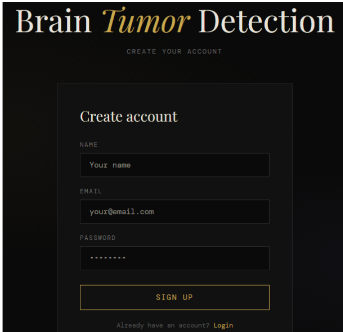
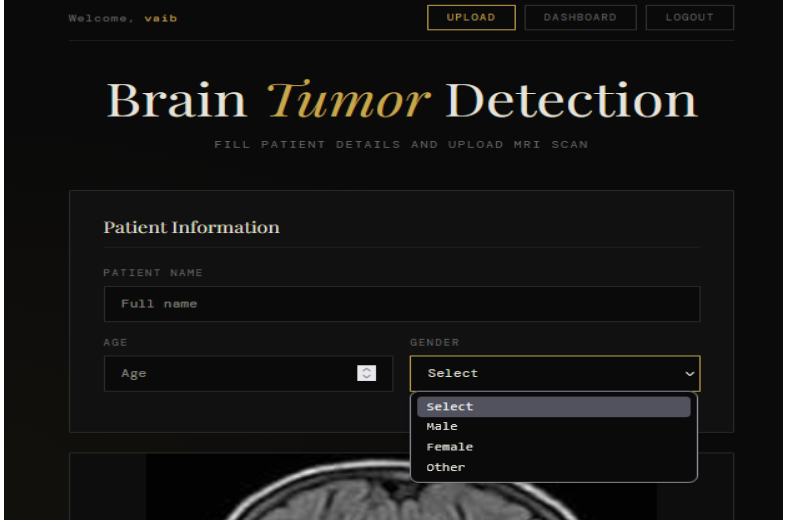
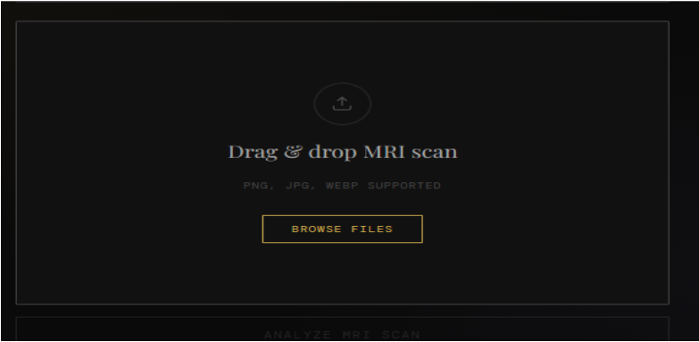
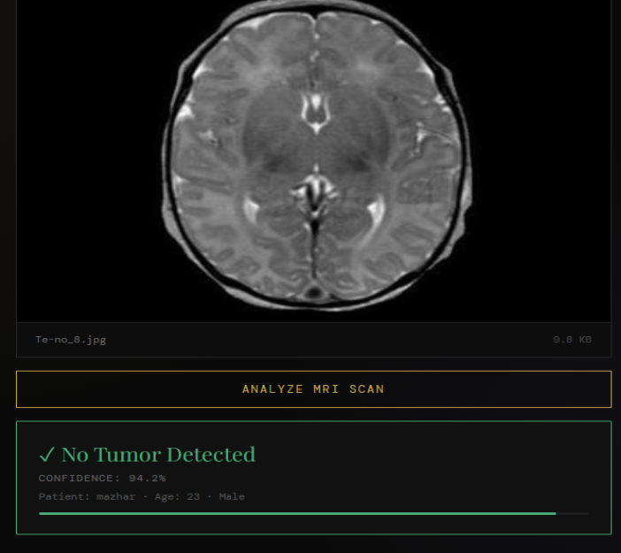
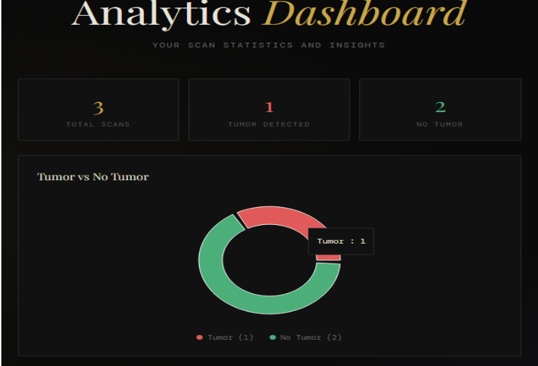
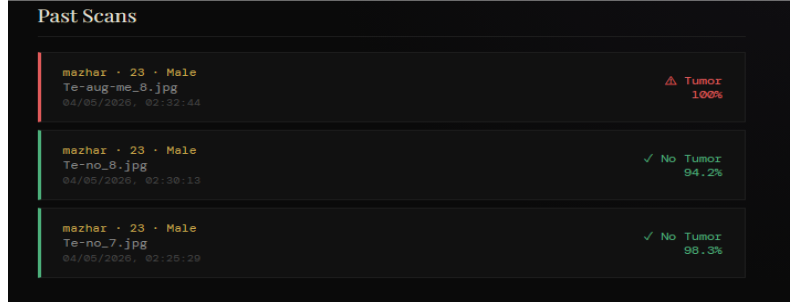

# 🧠 NeuroScan — Brain Tumor Detection System

> An AI-powered web application that analyzes brain MRI scans and detects the presence of tumors using deep learning.


---

## 📌 About

NeuroScan is a full-stack web application that uses **VGG16 Transfer Learning** to classify brain MRI images as **Tumor Present** or **No Tumor** with ~96–98% validation accuracy.

Built as a Final Year B.Tech Project by **Vaibhav Singh** — Lloyd Institute of Engineering and Technology (AKTU).

---

## ✨ Features

- 🔐 Secure user authentication (JWT + bcrypt)
- 🖼️ MRI image upload with patient info (name, age, gender)
- 🤖 Instant AI prediction with confidence score
- 📋 Full scan history per user
- 📊 Analytics dashboard (pie chart + scans-over-time graph)

---

## 🧱 Tech Stack

| Layer | Technology |
|-------|-----------|
| Frontend | React.js, Recharts |
| Backend | Python, Flask, Flask-JWT-Extended |
| ML Model | TensorFlow, Keras, VGG16 (Transfer Learning) |
| Image Processing | OpenCV, NumPy |
| Database | MongoDB Atlas |
| Auth | JWT, Flask-Bcrypt |

---

## 📁 Project Structure

```
neuroscan/
├── backend/
│   ├── app.py              # Flask API
│   ├── model.py            # VGG16 model definition
│   ├── weights.weights.h5  # Trained model weights (see note below)
│   └── requirements.txt    # Python dependencies
├── frontend/
│   ├── src/
│   │   ├── App.js
│   │   ├── Dashboard.js
│   │   └── ...
│   └── package.json
├── .env.example            # Environment variable template
└── README.md
```

---

## ⚙️ Setup & Installation

### Prerequisites
- Python 3.8+
- Node.js 16+
- A [MongoDB Atlas](https://www.mongodb.com/atlas) account (free tier works)

---

### 1. Clone the repository

```bash
git clone https://github.com/your-username/neuroscan.git
cd neuroscan
```

---

### 2. Backend Setup

```bash
cd backend

# Create virtual environment
python -m venv venv
source venv/bin/activate      # Mac/Linux
venv\Scripts\activate         # Windows

# Install dependencies
pip install -r requirements.txt

# Set up environment variables
cp ../.env.example .env
# Edit .env and fill in your values (see below)
```

---

### 3. Add Model Weights

Download the trained model weights and place the file in the `backend/` folder:

```
backend/weights.weights.h5
```

> ⚠️ The weights file is not included in this repo due to GitHub's file size limit.
> You can train your own using the [Kaggle Brain MRI Dataset](https://www.kaggle.com/datasets/masoudnickparvar/brain-tumor-mri-dataset) or contact the author.

---

### 4. Frontend Setup

```bash
cd frontend
npm install
npm start
```

---

### 5. Run the Backend

```bash
cd backend
python app.py
```

Backend runs on: `http://localhost:5000`
Frontend runs on: `http://localhost:3000`

---

## 🔑 Environment Variables

Create a `.env` file in the `backend/` folder based on `.env.example`:

```env
MONGO_URI=your_mongodb_atlas_connection_string
JWT_SECRET_KEY=your_secret_key_here
```

---

## 🤖 Model Details

| Property | Value |
|----------|-------|
| Base Model | VGG16 (pretrained on ImageNet) |
| Task | Binary Classification (Tumor / No Tumor) |
| Input Shape | 224 × 224 × 3 |
| Output | Sigmoid probability |
| Optimizer | Adam |
| Loss | Binary Cross-Entropy |
| Validation Accuracy | ~96–98% |
| Dataset | Kaggle Brain MRI (~3,000 images) |

---

## 📸 Screenshots

#Login Page



#Patient Information



#MRI Upload



#Tumor Detection Result



#Dashboard



#Scan History


---

## 👤 Author

**Vaibhav Singh**
- 📧 vaibhavsingh4009@gmail.com
- 🎓 B.Tech CSE (Data Science) — Lloyd Institute of Engineering and Technology, AKTU

---

## 📄 License

This project is for academic purposes only.
